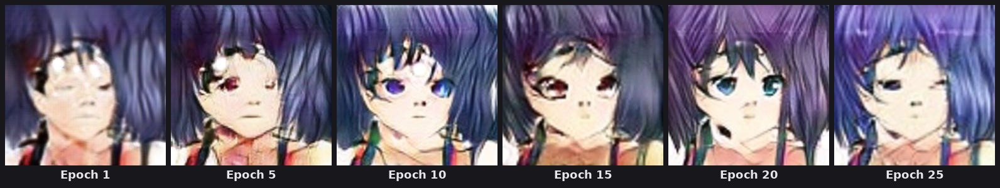
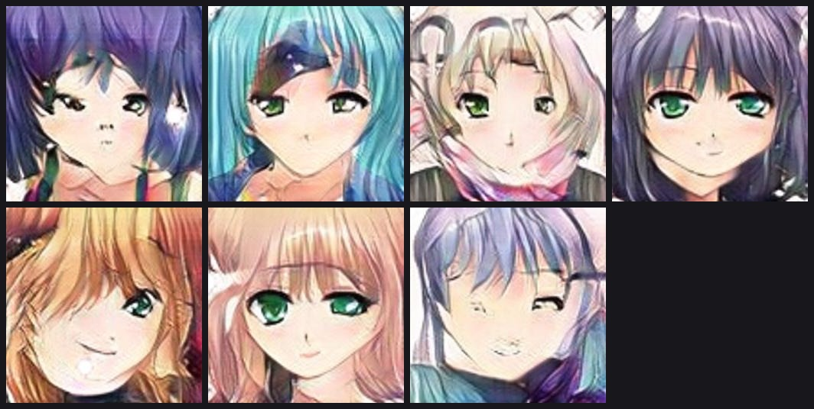

# 🎨 Face → Anime AI

<p align="center">
  
  
  
  
  
  
  
</p>

<p align="center">
  <strong>Turn a real human face into anime-style art — with your own trained CycleGAN or a pretrained AnimeGANv2 model.</strong>
</p>

<p align="center">
  A complete end-to-end deep learning application: dataset exploration, model training from scratch,
  face-aware inference, a dual-model REST API, a React frontend, and GPU-ready Docker deployment.
</p>

<p align="center">
  <a href="#-what-is-face--anime-ai">Overview</a> •
  <a href="#-features">Features</a> •
  <a href="#-architecture">Architecture</a> •
  <a href="#-model">Model</a> •
  <a href="#-installation">Installation</a> •
  <a href="#-training">Training</a> •
  <a href="#-inference">Inference</a> •
  <a href="#-fastapi">API</a> •
  <a href="#-docker">Docker</a>
</p>

---

## ✨ What is Face → Anime AI?

**Face → Anime AI** is an unpaired image-to-image translation system. At its core is a **CycleGAN**
trained from scratch on a real-face domain and an anime-face domain, with no paired examples required.
The API also ships a second option, **Anime2 V2** — the AnimeGANv2 (`face_paint_512_v2`) generator
architecture with its pretrained weights re-hosted as our own checkpoint — so a user can compare
the from-scratch CycleGAN against a well-known reference model from a single interface.

```text
                    ┌─────────────────────┐
                    │      CycleGAN       │
                    │                     │
 Real Face ───────► │  G: Face → Anime    │ ───────► Anime
                    │                     │
 Anime ───────────► │  G: Anime → Face    │ ───────► Real Face
                    └─────────────────────┘
```

The project is built as a complete ML application, not just a training script:

```text
Dataset → EDA → Preprocessing → PyTorch Dataset/DataLoader
   → CycleGAN Training → Checkpointing → Face-Cropped Inference
   → FastAPI (dual model) → React → Docker + CUDA → GPU Deployment
```

---

## 🚀 Features

### 🤖 Machine Learning

- Custom **CycleGAN** trained from scratch (unpaired face ↔ anime translation)
- ResNet-based generator (9 residual blocks, reflection padding, instance norm)
- PatchGAN discriminator (4-layer conv stack)
- LSGAN adversarial objective, cycle-consistency loss (L1), identity loss (L1)
- **Fake-image replay buffer** (`ImagePool`, size 50) to stabilize discriminator training
- **Linear learning-rate decay** starting at the midpoint of training
- Second model, **Anime2 V2** — the AnimeGANv2 generator architecture (`face_paint_512_v2` weights), re-packaged as its own checkpoint (`anime2_v2.pth`) and hosted on our Hugging Face repo, so inference no longer depends on `torch.hub` at request time
- 256×256 training resolution, CUDA-accelerated training and inference

### 🧪 Data Pipeline

- Jupyter-based EDA (`notebooks/01_EDA.ipynb`)
- JSON-indexed train/test splits for both domains (`data/processed/*/*.json`)
- Configurable `torchvision` transform pipelines for train vs. test
- Custom PyTorch `Dataset` that pairs a real face with a randomly sampled anime image each step
- **Automatic face detection & cropping** at inference time (OpenCV Haar cascade, with margin and square-padding), so arbitrary photos don't need to be pre-cropped

### 🌐 Application

- FastAPI inference service with **model selection** (`cyclegan_v1` or `anime2_v2`) per request, plus a `/models` endpoint the frontend queries to build its model picker
- Each model has its own checkpoint filename; missing checkpoints are downloaded from Hugging Face on first request for that model (not at startup) and then cached
- React + Vite frontend: upload, live preview, model picker (populated from `/models`), generate, download result
- `/health` endpoint reporting device, available/loaded models, and the checkpoint directory in use

### 🐳 Deployment

- Separate Dockerfiles for backend (PyTorch + CUDA base image) and frontend (Node build → Nginx)
- `docker-compose.yml` wiring both services together with a shared checkpoint volume
- GPU passthrough ready (NVIDIA Container Runtime)

---

## 🏗️ Architecture

```text
                         USER
                           │
                           ▼
                ┌────────────────────┐
                │   React Frontend   │
                │                    │
                │  Upload · Preview  │
                │  Pick Model        │
                │  Generate          │
                └─────────┬──────────┘
                          │ POST /predict  (form fields: file, model=cyclegan_v1|anime2_v2)
                          ▼
                ┌────────────────────────────┐
                │          FastAPI           │
                │ /health /models /predict   │
                └─────────────┬──────────────┘
                          │
              ┌───────────┴───────────┐
              ▼                       ▼
    ┌───────────────────┐   ┌──────────────────────────┐
    │ cyclegan_v1        │   │ anime2_v2                │
    │ Custom CycleGAN    │   │ AnimeGANv2 architecture  │
    │ face-crop → resize │   │ face-crop → resize       │
    │ G_face2anime       │   │ weights mirrored to HF   │
    └─────────┬──────────┘   └───────────┬──────────────┘
              └───────────┬──────────────┘
                          ▼
                ┌────────────────────┐
                │   PyTorch + CUDA   │
                └─────────┬──────────┘
                          ▼
                    Anime Image
```

---

## 🧠 Model

### Pretrained checkpoints

Both checkpoints are hosted on Hugging Face rather than committed to Git — the repo they're
served from is set by the `HF_BASE_URL` environment variable (defaults to
`https://huggingface.co/dileepkumar5175/face_to_anime/resolve/main`):

| `model` value | Checkpoint file | Architecture | Download |
|---|---|---|---|
| `cyclegan_v1` | `best_model.pth` | Custom `ResnetGenerator` (9 residual blocks), trained from scratch in this repo | 👉 [**Download `best_model.pth`**](https://huggingface.co/dileepkumar5175/face_to_anime/resolve/main/best_model.pth) |
| `anime2_v2` | `anime2_v2.pth` | `AnimeGANv2Generator` — the AnimeGANv2 (`face_paint_512_v2`) architecture, with its pretrained weights re-saved as a standalone checkpoint (see `src/models/animegan.py`) | 👉 [**Download `anime2_v2.pth`**](https://huggingface.co/dileepkumar5175/face_to_anime/resolve/main/anime2_v2.pth) |

Place whichever checkpoint(s) you need inside `checkpoints/`:

```text
Face-Anime-AI/
├── checkpoints/
│   ├── best_model.pth     # cyclegan_v1
│   └── anime2_v2.pth      # anime2_v2
├── src/
├── requirements.txt
└── README.md
```

> **Note:** you don't need to download these manually to run the API — if a checkpoint isn't
> found in `CHECKPOINT_DIR` (default `checkpoints/`) the first `/predict` request for that model
> triggers an automatic download from `HF_BASE_URL` before inference runs. Manual download is
> only needed for offline use, CLI inference (`src/inference.py`), or pre-warming the Docker
> `model_cache` volume.

The `checkpoints/` directory is excluded from Git via `.gitignore`.

### Why CycleGAN?

CycleGAN removes the need for paired training data. Instead of requiring matched pairs like:

```text
Real Face A  ↔  Anime Face A
Real Face B  ↔  Anime Face B
```

it learns from two independent, unpaired collections:

```text
REAL DOMAIN                  ANIME DOMAIN
Face 1                       Anime 1
Face 2                       Anime 2
Face 3                       Anime 3
  ...                           ...
```

### Two generators, two discriminators

```text
G_face2anime : Real Face → Anime Image
G_anime2face : Anime Image → Real-style Face

D_face  : Real Face vs. Generated Face   (PatchGAN)
D_anime : Real Anime vs. Generated Anime (PatchGAN)
```

### Cycle consistency

```text
                 G_face2anime
Real Face ─────────────────────► Fake Anime
    ▲                                  │
    │                                  ▼
    └──────────── G_anime2face ────────┘

Real Face ≈ Reconstructed Face
```

### Loss functions

```text
L_G = L_adversarial(LSGAN) + λ_cycle · L_cycle(L1) + λ_identity · L_identity(L1)
```

Defaults used in training: `lambda_cycle=10.0`, `lambda_identity=0.5`, `lr=2e-4`, with linear LR
decay beginning halfway through the run and a 50-image fake-sample replay buffer feeding the
discriminators.

---

## 📊 Dataset & Preprocessing

```text
Raw Data → EDA (notebooks/01_EDA.ipynb) → JSON train/test index files
   → CycleGANDataset (pairs real ↔ randomly-sampled anime) → DataLoader → CycleGAN
```

- **Training transforms:** resize (1.12×) → random crop to 256×256 → random horizontal flip → tensor → normalize to `[-1, 1]`
- **Test transforms:** deterministic resize to 256×256 → tensor → normalize
- **Inference preprocessing:** the input photo is first run through `crop_face()`, which uses an OpenCV Haar-cascade face detector to find the largest face, adds a 25% margin, and pads it to a square before resizing — so users can upload a normal photo, not a pre-cropped headshot.

---

## 📈 Results

### Training progression

The same input, translated by checkpoints from different points in training — the model starts
from noisy color blobs and progressively learns anime-style eyes, shading, and line work:

<p align="center">
  
</p>

### Latest result

Output from the most recent checkpoint (epoch 25):

<p align="center">
  
</p>

> This is the newest checkpoint in `data/sample_images/`, not necessarily the final trained
> model — swap in your own `best_model.pth` output here once training finishes.

### Anime-domain reference samples

A few examples from the anime-face domain the generator is trained to match:

<p align="center">
  
</p>

---

## 🗂️ Project Structure

```text
Face-Anime-AI/
│
├── data/
│   ├── processed/          
│   └── sample_images/      
│
├── checkpoints/            
│
├── src/
│   ├── api/
│   │   └── app.py          
│   ├── data/
│   │   ├── dataset.py       
│   │   ├── dataloader.py    
│   │   ├── preprocessing.py
│   │   └── transforms.py    
│   ├── models/
│   │   ├── generator.py    
│   │   ├── discriminator.py 
│   │   ├── cyclegan.py      
│   │   ├── animegan.py      
│   │   └── losses.py
│   ├── utils/
│   │   ├── checkpoint.py    
│   │   └── image_pool.py    
│   ├── inference.py         
│   └── trainer.py           
│
├── notebooks/
│   ├── 01_EDA.ipynb
│   └── test_evaluation.ipynb
│
├── frontend/                
│   ├── src/App.jsx
│   └── Dockerfile
│
├── Dockerfile               
├── docker-compose.yml
├── requirements.txt
└── README.md
```

---

## ⚙️ Installation

**Requirements:** Python 3.12, a CUDA-capable NVIDIA GPU (recommended, not required), Node.js, Docker Desktop (optional, for containerized runs).

```bash
git clone https://github.com/dileepkumar2626/Face-Anime-AI.git
cd Face-Anime-AI

python -m venv .venv
Windows: .venv/Scripts/activate

pip install -r requirements.txt
```

Core dependencies: `torch`, `torchvision`, `Pillow`, `opencv-python-headless` (for face cropping),
`scikit-learn`, `fastapi`, `uvicorn`, `python-multipart`.

---

## 🧪 Training

```bash
python src/trainer.py
```

`train()` accepts:

```python
train(
    num_epochs=50,
    lr=2e-4,
    lambda_cycle=10.0,
    lambda_identity=0.5,
    checkpoint_dir="checkpoints",
    log_every=50,
    decay_epoch=None,   
    device=None,       
```

Each epoch saves a numbered checkpoint (`epoch_NNN.pth`) and updates `best_model.pth` whenever the
average epoch loss improves. Batches print running totals for the discriminator, cycle, and
identity losses every `log_every` steps.

---

## 🖼️ Inference

```bash
python src/inference.py \
    --checkpoint checkpoints/best_model.pth \
    --input path/to/face.jpg \
    --output anime_result.jpg
```

Pipeline: `Face Detection & Crop → Resize (256×256) → Normalize → G_face2anime → Denormalize → Save`

---

## 🌐 FastAPI

```bash
uvicorn src.api.app:app --host 0.0.0.0 --port 8000
```

| Endpoint            | Method | Purpose                                                                 |
|---------------------|--------|--------------------------------------------------------------------------|
| `/health`           | GET    | Device, `available_models` / `loaded_models`, and the active checkpoint directory |
| `/models`           | GET    | List of models (`id`, `name`, `description`) for the frontend's picker |
| `/models/{model_id}`| GET    | Single model's checkpoint filename, `downloaded`, and `loaded` status  |
| `/predict`          | POST   | Multipart form: `file` (image) + `model` (`cyclegan_v1` or `anime2_v2`, defaults to `anime2_v2`) |
| `/docs`             | GET    | Interactive Swagger UI                                                  |

Models are loaded lazily and cached in memory: the first `/predict` (or `/models/{model_id}`
checkpoint check) for a given `model` downloads its checkpoint from `HF_BASE_URL` if it isn't
already in `CHECKPOINT_DIR`, loads it, and keeps it resident for subsequent requests — a failure
for one model doesn't affect the other. CORS currently allows `http://localhost:5173` and
`http://127.0.0.1:5173` for local frontend development (update the placeholder origin in
`src/api/app.py` before deploying).

---

## 💻 React Frontend

```bash
cd frontend
npm install
npm run dev
```

The UI lets a user upload a photo, pick between **CycleGAN (custom model)** and **AnimeGANv2**, preview
the source image, generate, and download the result. It talks to the API via `VITE_API_URL` and
`POST /predict?model=...`.

---

## 🐳 Docker

```bash
docker compose up
```

- **Backend** — `pytorch/pytorch:2.7.1-cuda12.6-cudnn9-runtime` base, installs project requirements
  plus FastAPI/uvicorn, and serves on `:8000`. The Dockerfile still pre-downloads the original
  AnimeGANv2 weights via `torch.hub` at build time — this predates the switch to per-model
  Hugging Face checkpoints in `src/api/app.py` and is no longer read by the running API (see
  Future Work); the actual `cyclegan_v1` / `anime2_v2` checkpoints are fetched into the
  `model_cache` volume at request time instead.
- **Frontend** — multi-stage build: `node:22-alpine` builds the Vite app, then `nginx:alpine` serves
  the static bundle on `:80` (mapped to `:5173` by Compose).
- A named volume (`model_cache`) persists downloaded checkpoints for both models across container restarts.
- GPU passthrough is present in `docker-compose.yml` but commented out (`# gpus: all`) — uncomment
  it on a host with the NVIDIA Container Toolkit installed.

Once running:

```text
Frontend: http://localhost:5173
Backend:  http://localhost:8000
API docs: http://localhost:8000/docs
```

---

## ⚡ GPU Acceleration

```python
device = "cuda" if torch.cuda.is_available() else "cpu"
```

Both training and inference auto-detect CUDA and fall back to CPU otherwise. Development and
testing were done on an NVIDIA RTX 4060.

---

## 🔬 Future Work

### Model & Training
- [ ] Larger, more diverse, and better-balanced dataset
- [ ] Higher-resolution generation beyond 256×256
- [ ] Super-resolution refinement pass on outputs
- [ ] Perceptual (VGG-based) loss for sharper detail

### Evaluation
- [ ] Automated image-quality metrics (FID/KID)
- [ ] A fixed benchmark set for checkpoint-to-checkpoint comparison
- [ ] Systematic evaluation of generalization on unseen faces

### Application
- [ ] Public cloud GPU deployment
- [ ] Production monitoring and API rate limiting
- [ ] Fix the default `CHECKPOINT_PATH` / checkpoint-filename mismatch between training output and API expectations
- [ ] Remove the now-unused `torch.hub` AnimeGANv2 download step from `Dockerfile` (superseded by the `anime2_v2.pth` Hugging Face checkpoint)
- [ ] Replace the placeholder CORS origin in `src/api/app.py` with the real deployment domain
- [ ] User authentication

---

## 🧰 Tech Stack

| Layer | Technology |
|---|---|
| Language | Python, JavaScript |
| Deep Learning | PyTorch, torchvision |
| Face Detection | OpenCV (Haar cascade) |
| Reference Model | AnimeGANv2 architecture (`anime2_v2.pth` checkpoint, mirrored from `torch.hub` weights) |
| Architecture | CycleGAN (ResNet generator, PatchGAN discriminator) |
| API | FastAPI, Uvicorn |
| Frontend | React 19, Vite |
| Web Server | Nginx |
| Containerization | Docker, Docker Compose |
| GPU Acceleration | NVIDIA CUDA |

---

## 👨‍💻 Author

**Dileep Kumar** — AI/ML Engineer · Deep Learning · Machine Learning Research

<p align="left">
  <a href="https://github.com/dileepkumar2626">
    
  </a>
  <a href="https://www.linkedin.com/in/dileep-kumarbh/">
    
  </a>
</p>

---

## 📚 Research

Based on **Unpaired Image-to-Image Translation using Cycle-Consistent Adversarial Networks**
(Zhu et al., CycleGAN), with the pretrained comparison model from **AnimeGANv2**
(bryandlee/animegan2-pytorch).

---

## 📄 License

Intended for educational, research, and portfolio purposes.